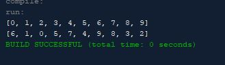

# ShuffleArrayList

Write the following method that shuffles an ArrayList
 public static <E> void shuffle(ArrayList<E>
  Basically, the assignment wants me create an arraylist then create a method that shuffles
  whatever is put into the array randomly, shuffling means putting the characters/strings whatever you want to put into
  it into random places on the array.

## Example Output

This image will display as your example output. Name the image README.jpg in your project folder.



## Analysis Steps

This section should restate the assignment and explain how you analyzed the requirements in order 
to develop a solution.

"Write the following method that shuffles an ArrayList"

Well basically I added the method that is provided to me on the assignment and basically just added the extra arguments
needed in the method in order to create the shuffling of the array while I placed an object in the main that displays some characters so I can
begin working on the method.

### Design

I used the main and the method that was provided to me to create this program.

```
public static void main(String[] args) {
        ArrayList<Integer> shufflelist = new ArrayList<>();
        
        for (int i = 0; i < 10; i++) {
```

### Testing

A step by step series of examples that you developed to properly test the program. 

Say what the step will be

```
Give the example
```

And repeat

```
until finished
```

End with an example of getting some data out of the system or using it for a little demo

## Notes

No issues or notes.

## Do not change content below this line
## Adapted from a README Built With

* [Dropwizard](http://www.dropwizard.io/1.0.2/docs/) - The web framework used
* [Maven](https://maven.apache.org/) - Dependency Management
* [ROME](https://rometools.github.io/rome/) - Used to generate RSS Feeds

## Contributing

Please read [CONTRIBUTING.md](https://gist.github.com/PurpleBooth/b24679402957c63ec426) for details on our code of conduct, and the process for submitting pull requests to us.

## Versioning

We use [SemVer](http://semver.org/) for versioning. For the versions available, see the [tags on this repository](https://github.com/your/project/tags). 

## Authors

* **Billie Thompson** - *Initial work* - [PurpleBooth](https://github.com/PurpleBooth)

See also the list of [contributors](https://github.com/your/project/contributors) who participated in this project.

## License

This project is licensed under the MIT License - see the [LICENSE.md](LICENSE.md) file for details

## Acknowledgments

* Hat tip to anyone who's code was used
* Inspiration
* etc
